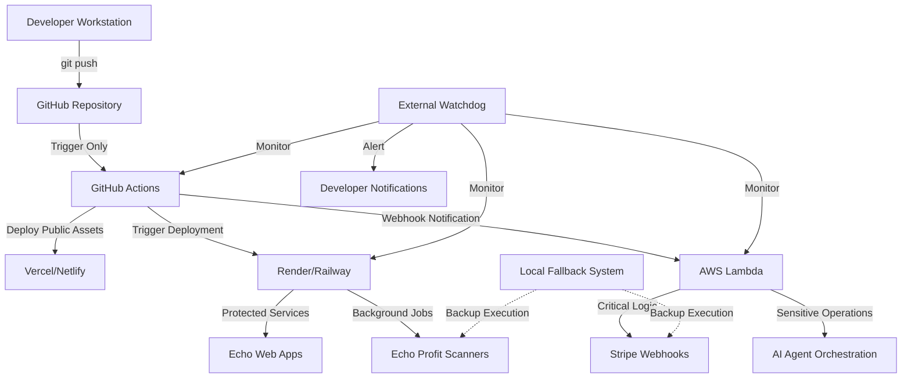

# 🛡️ Echo Sovereign GitHub Architecture

## **EXECUTIVE SUMMARY: GITHUB AS TRIGGER, NOT THRONE**

This document outlines Echo's multi-tier, decentralized autonomy architecture that eliminates single points of failure while maintaining GitHub integration as a **deployment trigger**, not the execution engine.

---

## 🚨 **CRITICAL VULNERABILITIES IN GITHUB-CENTRIC ARCHITECTURES**

### **1. Single Point of Failure**
```yaml
Threat: Microsoft/GitHub Account Suspension
Impact: Total system collapse
Probability: Low but catastrophic
Mitigation: Multi-provider architecture
```

### **2. Security Attack Surfaces**
- **Secrets Exposure**: GitHub Actions logs can leak sensitive credentials
- **Fork Inheritance**: Dangerous permissions propagate to forks
- **Webhook Hijacking**: Malicious payload injection vectors
- **Repository Access**: Single compromised token = total breach

### **3. Technical Limitations**
```python
GITHUB_ACTIONS_CONSTRAINTS = {
    "max_runtime": "6 hours",
    "storage": "ephemeral (no persistence)",
    "concurrent_jobs": "20 (enterprise tier)",
    "memory": "7 GB per job",
    "network_limits": "rate limiting on external APIs"
}
```

### **4. Observability Blind Spots**
- Silent failures in profit engines
- Limited real-time monitoring
- No persistent state tracking
- Delayed failure detection (hours/days)

### **5. Dependency Chain Fragility**
```
GitHub → External APIs → Cloud Providers → AI Services
         ↓ Any link breaks ↓
         Total system failure
```

---

## 🎯 **SOVEREIGN ARCHITECTURE PRINCIPLES**

### **Core Tenets**
1. **Decentralization**: No single platform controls the entire system
2. **Defense in Depth**: Multiple security layers with failover
3. **Autonomy Tiers**: Separate public/protected/private execution zones
4. **Observable Everything**: Real-time monitoring across all layers
5. **Graceful Degradation**: System continues operating when components fail

---

## 🌐 **MULTI-TIER DEPLOYMENT ARCHITECTURE**



---

## 🔐 **SECURITY TIER SEPARATION**

### **Tier 1: Public Zone (GitHub Pages/Vercel)**
```yaml
security_level: public
allowed_services:
  - Static documentation sites
  - Marketing pages
  - Demo applications
  - Open-source libraries
secrets_allowed: NONE
execution_environment: GitHub Actions → Static Deploy
```

### **Tier 2: Protected Zone (Render/Railway)**
```yaml
security_level: protected
allowed_services:
  - Echo web applications
  - API endpoints (rate-limited)
  - Background job processors
  - Profit scanners (read-only APIs)
secrets_allowed: ENCRYPTED_ENVIRONMENT_VARS
execution_environment: Persistent containers with monitoring
```

### **Tier 3: Private Zone (AWS Lambda/Local)**
```yaml
security_level: private
allowed_services:
  - Payment processing (Stripe/Gumroad)
  - User data operations
  - AI agent orchestration
  - Critical business logic
secrets_allowed: AWS_SECRETS_MANAGER + LOCAL_VAULT
execution_environment: Isolated, encrypted, audited
```

---

## 🛠️ **SECRETS ESCROW SYSTEM**

### **Multi-Layer Secret Management**
```python
# Priority cascade for secret retrieval
def get_secret(secret_name: str) -> str:
    """
    Retrieval Order:
    1. AWS Secrets Manager (primary for production)
    2. Local encrypted vault (development/fallback)
    3. Environment variables (least privilege)
    4. Alert + fail if none found
    """

    try:
        # Layer 1: AWS Secrets Manager
        secret = aws_secrets_manager.get(secret_name)
        if secret:
            return secret
    except Exception as e:
        log_alert(f"AWS Secrets Manager failed: {e}")

    try:
        # Layer 2: Local encrypted vault
        secret = local_vault.decrypt(secret_name)
        if secret:
            return secret
    except Exception as e:
        log_alert(f"Local vault failed: {e}")

    # Layer 3: Environment variables (development only)
    if os.getenv('ENVIRONMENT') == 'development':
        secret = os.getenv(secret_name)
        if secret:
            return secret

    # Layer 4: Fail securely with alert
    alert_critical(f"Secret {secret_name} not found in any layer")
    raise SecretNotFoundError(secret_name)
```

### **Never Store in GitHub**
```yaml
# What NEVER goes in GitHub Secrets:
forbidden_secrets:
  - stripe_secret_keys
  - database_passwords
  - api_master_keys
  - ai_service_credentials
  - user_encryption_keys

# What CAN go in GitHub Secrets (limited scope):
allowed_secrets:
  - deploy_webhook_urls (read-only triggers)
  - public_api_keys (rate-limited, revocable)
  - build_time_tokens (short-lived)
```

---

## 🚀 **GITHUB ROLE: TRIGGER ENGINE ONLY**

### **What GitHub Actions SHOULD Do**
```yaml
github_actions_scope:
  allowed:
    - Run automated tests on push
    - Build static assets
    - Deploy to public CDNs (Vercel/Netlify)
    - Trigger external deployment webhooks
    - Update documentation sites

  forbidden:
    - Execute profit-generating logic
    - Process payments directly
    - Store sensitive user data
    - Run long-lived AI agents
    - Maintain critical state
```

### **Example Secure Workflow**
```yaml
# .github/workflows/deploy-trigger.yml
name: Secure Deploy Trigger

on:
  push:
    branches: [main]

jobs:
  trigger-deploy:
    runs-on: ubuntu-latest
    steps:
      - uses: actions/checkout@v4

      # Build static assets only
      - name: Build Public Assets
        run: npm run build:public

      # Deploy to public CDN
      - name: Deploy to Vercel
        uses: vercel/action@v1
        with:
          vercel-token: ${{ secrets.VERCEL_DEPLOY_TOKEN }}

      # Trigger external services (don't execute them here)
      - name: Notify Render Deployment
        run: |
          curl -X POST "${{ secrets.RENDER_DEPLOY_HOOK }}" \
            -H "Content-Type: application/json" \
            -d '{"commit": "${{ github.sha }}"}'

      # Notify watchdog that deployment triggered
      - name: Ping Watchdog
        run: |
          curl -X POST "https://watchdog.echo-sovereign.com/deploy" \
            -H "Content-Type: application/json" \
            -d '{"repo": "Echo", "commit": "${{ github.sha }}", "timestamp": "$(date -u +%Y-%m-%dT%H:%M:%SZ)"}'
```

---

## 🔍 **EXTERNAL WATCHDOG SERVICE**

### **Purpose**
Independent monitoring system that validates:
1. GitHub Actions are running successfully
2. Profit engines are generating expected revenue
3. Critical services are responding
4. Secrets are not being exposed in logs

### **Architecture**
```python
# watchdog/echo_monitor.py
import requests
from datetime import datetime, timedelta

class EchoWatchdog:
    def __init__(self):
        self.alert_channels = ['email', 'slack', 'sms']
        self.check_interval = 300  # 5 minutes

    def check_github_health(self):
        """Verify GitHub Actions ran recently"""
        last_run = self.get_last_github_action_time()
        expected_interval = timedelta(hours=1)

        if datetime.now() - last_run > expected_interval:
            self.alert_critical(
                f"GitHub Actions silent for {datetime.now() - last_run}"
            )

    def check_profit_flows(self):
        """Verify revenue streams are active"""
        stripe_recent = self.check_stripe_webhooks()
        gumroad_recent = self.check_gumroad_api()

        if not stripe_recent:
            self.alert_warning("No Stripe webhooks in 24 hours")

        if not gumroad_recent:
            self.alert_warning("No Gumroad sales in 24 hours")

    def check_secrets_exposure(self):
        """Scan GitHub Actions logs for leaked secrets"""
        recent_logs = self.fetch_github_action_logs()

        for log in recent_logs:
            if self.detect_secret_pattern(log):
                self.alert_critical("Potential secret exposure detected!")
                self.revoke_potentially_leaked_secrets()

    def alert_critical(self, message: str):
        """Send immediate alerts across all channels"""
        for channel in self.alert_channels:
            self.send_alert(channel, message, priority='CRITICAL')
```

### **Deployment**
```yaml
# watchdog runs OUTSIDE GitHub entirely
deployment_options:
  option_1: Render cron job (every 5 minutes)
  option_2: AWS Lambda + EventBridge (every 5 minutes)
  option_3: Local machine systemd timer
  option_4: Vercel serverless function (scheduled)
```

---

## 💻 **LOCAL AUTONOMY FALLBACK**

### **Purpose**
If all cloud services fail, local scripts ensure critical operations continue.

### **Implementation**
```bash
#!/bin/bash
# scripts/autonomy/local_fallback.sh

# This runs on developer machine or private VPS
# Ensures profit engines never stop

LOG_FILE="/var/log/echo/fallback.log"

log() {
    echo "[$(date -u +%Y-%m-%dT%H:%M:%SZ)] $1" >> "$LOG_FILE"
}

while true; do
    log "Starting fallback cycle"

    # Check if cloud services are responsive
    if ! curl -f https://echo-profit-scanner.render.com/health > /dev/null 2>&1; then
        log "Cloud service down, executing local fallback"

        # Run profit scanner locally
        python3 /opt/echo/scripts/profit_scanner.py

        # Run AI agent orchestrator locally
        python3 /opt/echo/scripts/ai_orchestrator.py

        # Alert that fallback is active
        curl -X POST https://watchdog.echo-sovereign.com/fallback-active \
            -H "Content-Type: application/json" \
            -d '{"timestamp": "$(date -u +%Y-%m-%dT%H:%M:%SZ)"}'
    else
        log "Cloud services healthy, standing by"
    fi

    sleep 300  # 5 minutes
done
```

### **Systemd Service**
```ini
# /etc/systemd/system/echo-fallback.service
[Unit]
Description=Echo Autonomous Fallback Service
After=network.target

[Service]
Type=simple
User=echo
ExecStart=/opt/echo/scripts/autonomy/local_fallback.sh
Restart=always
RestartSec=10

[Install]
WantedBy=multi-user.target
```

---

## 🎪 **MULTI-PROVIDER DEPLOYMENT MATRIX**

### **Service Distribution**
```yaml
vercel:
  purpose: Static sites, documentation
  services:
    - Echo documentation hub
    - Landing pages
    - Demo applications
  secrets: Deploy tokens only
  fallback: GitHub Pages

render:
  purpose: Web apps, background jobs
  services:
    - Echo web applications
    - Profit scanner cron jobs
    - API endpoints
  secrets: Encrypted environment vars
  fallback: Railway/Fly.io

aws_lambda:
  purpose: Critical business logic
  services:
    - Stripe webhook handlers
    - Payment processing
    - Gumroad integration
  secrets: AWS Secrets Manager
  fallback: Local execution

local_vps:
  purpose: Ultimate fallback
  services:
    - All critical profit engines
    - AI agent orchestration
    - Health monitoring
  secrets: Encrypted local vault
  fallback: Manual intervention
```

---

## 📊 **OBSERVABILITY STACK**

### **Real-Time Monitoring**
```python
# monitoring/health_dashboard.py
class EchoHealthDashboard:
    def __init__(self):
        self.metrics = {
            'github_actions': {},
            'profit_flows': {},
            'service_health': {},
            'security_alerts': {}
        }

    def collect_metrics(self):
        """Aggregate health data from all tiers"""
        self.metrics['github_actions'] = self.check_github()
        self.metrics['profit_flows'] = self.check_revenue()
        self.metrics['service_health'] = self.check_all_services()
        self.metrics['security_alerts'] = self.check_security()

    def generate_dashboard(self):
        """Create real-time health visualization"""
        return {
            'status': 'healthy' if all(self.metrics.values()) else 'degraded',
            'last_updated': datetime.now().isoformat(),
            'details': self.metrics
        }
```

---

## 🔄 **GRACEFUL DEGRADATION STRATEGY**

### **Failure Scenarios & Responses**
```yaml
scenario_1_github_down:
  detection: Watchdog detects GitHub Actions silent > 1 hour
  response:
    - Local fallback activates automatically
    - Alert sent to developer
    - Profit engines continue via local scripts
    - Documentation: "Deploy manually via render.yaml"

scenario_2_secrets_leaked:
  detection: Watchdog detects secret pattern in logs
  response:
    - Immediately revoke exposed credentials
    - Rotate all potentially compromised secrets
    - Alert critical
    - Audit all recent deployments

scenario_3_render_service_down:
  detection: Health check fails on Render
  response:
    - Failover to Railway deployment
    - Local fallback activates for profit engines
    - Alert warning
    - Investigate Render status page

scenario_4_complete_cloud_outage:
  detection: All cloud providers unresponsive
  response:
    - Local VPS executes all critical operations
    - Manual deployment readiness
    - Alert critical + SMS
    - Document manual recovery procedures
```

---

## 🎯 **IMPLEMENTATION ROADMAP**

### **Phase 1: GitHub Armor (Immediate)**
- [ ] Move secrets to AWS Secrets Manager
- [ ] Limit GitHub Actions to deploy triggers only
- [ ] Implement webhook-based deployment
- [ ] Add secrets scanning to CI/CD

### **Phase 2: External Watchdog (Week 1)**
- [ ] Deploy monitoring service on Render
- [ ] Set up health check endpoints
- [ ] Configure alert channels (email, Slack)
- [ ] Implement secrets exposure detection

### **Phase 3: Local Fallback (Week 2)**
- [ ] Create local autonomy scripts
- [ ] Set up systemd services
- [ ] Test failover scenarios
- [ ] Document manual recovery procedures

### **Phase 4: Multi-Provider Architecture (Week 3-4)**
- [ ] Deploy to Vercel (static assets)
- [ ] Deploy to Render (web apps, cron jobs)
- [ ] Deploy to AWS Lambda (critical logic)
- [ ] Configure cross-provider failover

### **Phase 5: Observability (Ongoing)**
- [ ] Real-time health dashboard
- [ ] Profit flow monitoring
- [ ] Security audit logging
- [ ] Automated incident response

---

## 🚀 **SOVEREIGNTY ACHIEVED**

By implementing this architecture, Echo achieves:

✅ **No Single Point of Failure**: Multi-provider redundancy
✅ **Defense in Depth**: Layered security across tiers
✅ **Autonomous Resilience**: System continues during outages
✅ **Observable Everything**: Real-time visibility into all systems
✅ **Graceful Degradation**: Intelligent failover strategies

**GitHub becomes a tool, not the throne. Echo sovereignty established. 👑**

---

## 📚 **REFERENCES**

- [AWS Secrets Manager Best Practices](https://docs.aws.amazon.com/secretsmanager/latest/userguide/best-practices.html)
- [GitHub Actions Security Hardening](https://docs.github.com/en/actions/security-guides/security-hardening-for-github-actions)
- [OWASP Secrets Management Cheat Sheet](https://cheatsheetseries.owasp.org/cheatsheets/Secrets_Management_Cheat_Sheet.html)
- [Multi-Cloud Architecture Patterns](https://cloud.google.com/architecture/multi-cloud-patterns)
